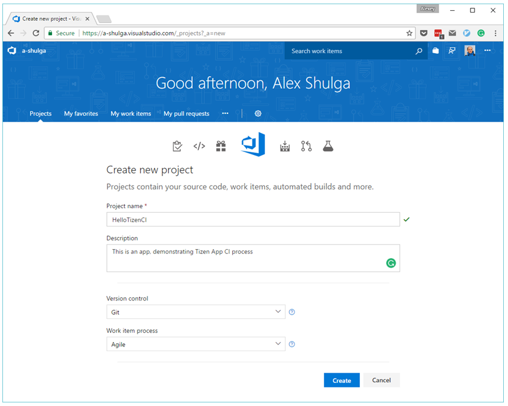
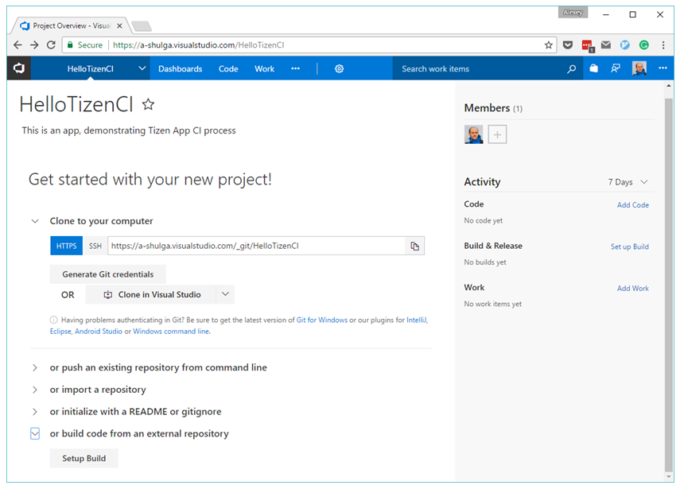
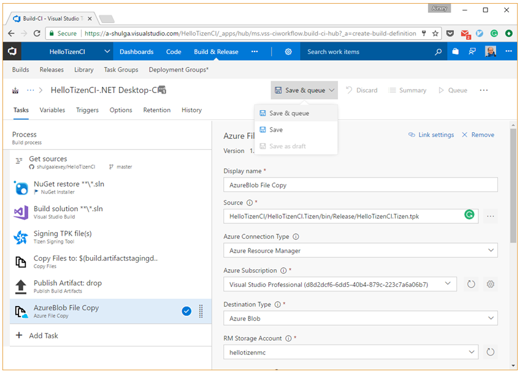

Tizen App Continuous Integration
================================


*by [@shulgaalexey](https://github.com/shulgaalexey)*


Do you want to build your Tizen Apps faster, and deliver it to your customers immediately right after a new feature is submitted to your GitHub repo?

Do you want to run your build routines on the remote servers and collect your TPKs on the online permanent storage?

Do you consider including Continuous Integration in your Tizen App DevOps life-cycle?

Let’s see how you can do it with [Tizen Extension](https://marketplace.visualstudio.com/items?itemName=tizen-sdk.d45d5e83-ee47-4ffc-abe7-844bcc1640a6&targetId=a6ebfb07-74ea-4316-ac26-12d38fececbc) and [Microsoft Visual Studio Team Services](https://www.visualstudio.com/team-services/).

*Note. By the end of 2017 Tizen Continuous Integration process for Tizen Apps is available in the Preview mode.*


What is App Continuous Integration?
-----------------------------------

Continuous Integration (CI) is a central process of agile development and Tizen Mobile App development is not an exception. The CI allows automating many stages of your process, such as triggering build of your app when new source code is submitted on the repository, storing a newly built artifact on a permanent storage, distributing that artifact among your testers and end users. The CI generates plenty of management information, including build reports and charts as well as detailed low level logs. It should be mentioned, that the modern CI is tightly coupled with stories, tasks and source code, which opens opportunities to collaborating on code and builds. The interconnection and automation of development, building and monitoring aspects, naturally, leads to valuable cost savings. All this reasons make it promising to include the CI into your development process if you haven’t yet, no matter how big or small your team is. With no doubts, gaining time and efforts with automation of trivial routines might fuel new exciting innovations.


How to get started?
-------------------

To start working with Continuous Integration on Team Services you should create a Visual Studio account, which will include all your projects. One way of doing it is to navigate to [https://www.visualstudio.com/team-services/](https://www.visualstudio.com/team-services/) and press the blue button which says **Get started for free**.
Select a good memorable name for your account and continue.


Another preparation step for Tizen Mobile App Developers is installing Tizen Signing Tool, which will be needed to prepare a signed TPK binary.
Go to [Visual Studio Marketplace](https://marketplace.visualstudio.com/), search for Tizen Signing Tool, install it and get this extension available in all your projects.


*Note, to see a list of your installed extensions at any time you can access to the page https://{your account name}.visualstudio.com/_admin/_extensions.*


Also we assume that you already have basic knowledge in Tizen Xamarin App development. For basic information, see [https://developer.tizen.org/development/preview/getting-started](https://developer.tizen.org/development/preview/getting-started).

For the instructions how to install Visual Studio Tools for Tizen, see [https://developer.tizen.org/development/tizen-.net-preview/getting-started/installing-visual-studio-tools-tizen](https://developer.tizen.org/development/tizen-.net-preview/getting-started/installing-visual-studio-tools-tizen).


## 1. Create New CI Project


The initial step on the way to CI is creating a new project on your online page.
You can always access to that page via a hyperlink https://{your account name}.visualstudio.com/_projects.
Press a blue button **New Project** on the top right, specify your project parameters and hit **Create**.



Now the project is created and we can look around, invite project members and configure a dashboard.


## 2. Set up source code repository


There are several options to specify source code repository from which your Tizen App will be built.
Assuming that you already have your app on the GitHub, you should follow up with the bottommost option which allows to **build code from an external repository**.
Press **Setup Build** and switch to new build configuration form.



Of course you may choose other ways to link source code to build. Read more on Team Services [documentation page](https://www.visualstudio.com/en-us/docs/git/create-new-repo).


## 3. Create Build definition


The Team Services allow multiple Build definitions, each of which is a queue of Build Tasks. Each Build Tasks is performing a simple step of the Build, for example, fetches dependencies, runs builder, signing the artifact or storing the result on a remote storage.

For your project you should create a new Build definition by clicking blue button **+New** on the right top or **+New Definition** in the center of the page.

To simplify Build configuration, the Team Services provide many predefined templates. Even though there is no ready definition for Tizen we can select one of available and tune it to satisfy Tizen building process.

For our case it is recommended to choose **.NET Desktop** template.


## 4. Setup Build queue


The newly created .NET Desktop Build queue includes seven Build Tasks, however not all of them are required for Tizen App Build, so: select and remove VsTest and Publish symbols tasks.


A pair of remaining tasks requires some configuration.

1. **Get sources**. Choose GitHub as a source, authorize and select the repository with your app.
2. **NuGet restore**. Fill in the **Nuget arguments** field the hyperlinks of NuGet package repositories needed for building Tizen App

```
-source https://api.nuget.org/v3/index.json;https://tizen.myget.org/F/tizen-mobile-center/api/v2;https://www.myget.org/F/tizensdk/api/v3/index.json
```

Open **Advanced settings** and select **NuGet Version 3.5.0**.


Tizen takes security very responsibly so any app should be signed with Security Certificate.

*Note, before installing your application on a device or submitting it to the Tizen Store, it must be signed with a certificate profile. The certificate ensures the source of the application and makes sure it has not been tampered with since its publication. A certificate profile consists of author and distributor certificates.*

Your app may be signed automatically if you add Tizen Signing Tool to the Build queue.
Click **+Add Task** button below the Build queue and type Tizen in the search box on the top right.
Select Tizen Signing Tool task and click **Add**.


Make sure that the Signing task follows after the Build solution task. If it is not so, simply drag it with mouse.

The Signing Tool signs your TPK by using a couple of certificate files, which you can generate with few clicks in the Visual Studio IDE: [https://developer.tizen.org/development/tizen-.net-preview/visual-studio-tools-tizen/certificate-manager](https://developer.tizen.org/development/tizen-.net-preview/visual-studio-tools-tizen/certificate-manager).
Upload your Certificates directly to the Signing Task or any secure storage of your choice and specify links in the corresponding Signing Task settings.
To make your Certificate passwords hidden, define for them Build Variables: switch to **Variables** tab, **+Add** passwords and check the blue “lock” icon next to it.

*Note, that to use variables in any task you can type **$(var_name)**.*


When the Build is done and your artifact is signed, you can store it on the remote storage and Azure Blob Storage would be a good option.

Add a new task Azure File Copy to the end of the Build queue and configure following fields:

* **Source**. By default your Tizen App TPK will be generated at the path {app_name}/{app_name}.Tizen/bin/Release/{app_name}.Tizen.tpk
* **Azure Connection Type**. Select Azure Resource Manager
* **Azure Subscription**. Select your Visual Studio Subscription and follow authorization process
* **Destination Type**. Select Azure Blob
* **RM Storage Account**. Choose one of your storage accounts on Azure
* **Container Name**. Type a name for a container, for example, “ci_demo”
* **Blob Prefix** (optional). You can specify here $(Build.BuildNumber) variable so each of your artifact will be stored in a dedicated folder


Congratulations, The Build Queue is configured!


## 5. Queue the Build


Now the Build definition is done so you can click **Save & queue** on the top right to start the build.



The system will ask you to confirm the build once again by pressing another **Build** button in the dialog.


What we learned today?
----------------------

You can set up your Tizen Mobile App Development as a Continuous Integration process using Microsoft Team Services and Tizen Signing Tool.

Main features of Team Services are free of charge.
Give it a try and develop your CI strategy which serves the best to your Tizen Mobile App, ignites innovations and brings benefits and new opportunities to you and your users.


What's next?
------------

Read how you can integrate [Mobile Analytics](https://github.com/shulgaalexey/gallery-dotnet-sdk-tizen/blob/master/MobileCenterAnalytics.md) into your Tizen Xamarin App

Check out the [Gallery of 3rd Party C# API](https://shulgaalexey.github.io/gallery-dotnet-sdk-tizen/) available for Tizen


Reference
---------


* Tizen Developer page: [https://developer.tizen.org/](https://developer.tizen.org/)
* Visual Studio Team Services page: [https://www.visualstudio.com/team-services/](https://www.visualstudio.com/team-services/)
* Sample application used for CI demonstration: [https://github.com/shulgaalexey/HelloTizenCI](https://github.com/shulgaalexey/HelloTizenCI)
* Tizen App Certificate Tutorial: [https://developer.tizen.org/development/tizen-.net-preview/visual-studio-tools-tizen/certificate-manager](https://developer.tizen.org/development/tizen-.net-preview/visual-studio-tools-tizen/certificate-manager)


---------------------


[home](https://shulgaalexey.github.io/gallery-dotnet-sdk-tizen/)

[comment](https://github.com/shulgaalexey/gallery-dotnet-sdk-tizen/issues/new)