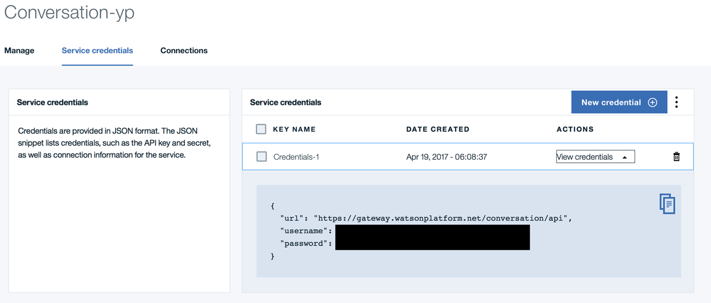

Communicating with an IBM Chat Bot from Tizen
=============================================

This article is about how to use the [IBM Watson Conversation](https://www.ibm.com/watson/developercloud/conversation.html) C# SDK to communicate with an IBM Chat Bot from a Tizen Device. Developers who wish to create natural language conversation solutions i.e. chat bots that automatically answer user queries or requests, would find this article useful.

IBM Watson Conversation Service is developed by IBM. IBM offers instructions on the whole process of Bot creation to usage. This article just introduces the IBM Watson Conversation Service and discusses the possibility of implementing it in Tizen.


What is IBM Watson?
-------------------

[IBM Watson](https://www.ibm.com/watson/) is a set of Cognitive Services developed by IBM that provide you with the capability to add intelligence to your applications. There are a wide range of services offered by Watson under different domains.

Examples of such services include:

* Conversation Service

* Speech To Text Service

* Text To Speech Service

* Visual Recognition Service, etc...

You can find the full list of service over [here](https://www.ibm.com/watson/developercloud/services-catalog.html). The Conversation service listed above is used for Chat Bot creation. 


Basic Procedure
---------------

There are two main steps involved in the whole process.

1.	Setting up the chat bot using the Web UI

2.	Creating the Client App using the C# SDK


Setting Up the Chat Bot Logic:
-----------------------------

Configuring the Cloud side of the ChatBot requires the following steps:

1.	Creating an IBM BlueMix account [here](https://console.ng.bluemix.net/registration/?). BlueMix is the Cloud Platform developed by IBM that hosts all its services including the Watson Service

2.	Create a Watson conversation service. On the BlueMix DashBoard, you can create and add a Watson Conversation Service to your list of services.

3.	Obtain the credentials for the conversation service (username and password). There credentials can be obtained from the page of the service you just created. They are required in the client SDK for authentication



4.	Go to [ibmwatsonconversation.com](http://www.ibmwatsonconversation.com/). This is the homepage for the IBM Watson Conversation service. Login with your BlueMix credentials. You will be presented with the Conversation Dashboard


5.	Create a workspace for your bot. Your conversation dashboard can have multiple workspaces. Each workspace contains a bot definition.

6.	Configure the intents, entities and dialogs for your bot. For more information on creation of Bot using the Conversation Service, please refer to IBM documentation and blogs.

    *(Note: We do not delve deep into the creation of the bot as the main purpose of the article is to demonstrate that you can build Tizen Apps to communicate with an IBM Bot)*


Creating the Client App:
-----------------------

Once you have fully configured the Watson Conversation service on the Cloud, it is time to query it from the client side.

1.	To query the bot from a Tizen device, we need to create a Tizen Xamarin Forms Application. Create either a Tizen Xamarin Forms Single or Portable Application. If you are not familiar with the creation of a Tizen Xamarin Forms Application, please refer [here](https://developer.tizen.org/development/preview/getting-started).

2.	Once you create a Tizen Xamarin Forms Application in Visual Studio, add the following Nuget Packages to your project using either the Nuget Package Manager GUI or the Command Line Interface offered by Visual Studio:

    * IBM.WatsonDeveloperCloud : Version 1.1.0

    * IBM.WatsonDeveloperCloud.Conversation.v1 : Version 1.1.0

    * Newtonsoft.Json : Version 9.0.1

    * Wdc.System.Net.Http.Formatting.NetStandard : Version 1.0.0

    *(Note: The SDK is under development by IBM. So the package versions may be updated frequently and the API signatures could change)*

3.	Also add the Tizen Internet Privilege to the tizen-manifest.xml file of your application:

```xml
        <privileges>
            <privilege>http://tizen.org/privilege/internet</privilege>
        </privileges>
```

You can now start using the SDK to query the Watson Bot from your Tizen Device.

Below is a sample code that sends a “HelloWorld” query to a bot.

Sample Code:
-----------

```csharp
ConversationService conversationService = new ConversationService("<username>", "<password>", ConversationService.CONVERSATION_VERSION_DATE_2017_05_26);

MessageRequest messageRequest = new MessageRequest()
{
    Input = new InputData()
    {
        Text = "HelloWorld",
    }
};

var result = conversationService.Message("<workspace-id>", messageRequest);

string[] output = result.Output.Text;
```

Explanation:
------------

First, we create a **```ConversationService```** instance using the username and password we obtained when creating the conversation service on the IBM BlueMix portal. Then we create a **```MessageRequest```** object that has our input text **```“HelloWorld”```**. We then use the **```ConversatoinService.Message()```** method to query the Bot. The output is a list of string replies that can be obtained from the result of the query.

For more information on the SDK sources and usage, refer [here](https://github.com/watson-developer-cloud/dotnet-standard-sdk/tree/development/src/IBM.WatsonDeveloperCloud.Conversation.v1).

What we learnt today?
---------------------

IBM Watson Conversation service can be used to create Simple Chat Bots for customer service/ other uses. Using the C# SDK for the IBM Watson Conversation Service, the Chat Bot can be queried from a Tizen Device. 

For bots where you need to query an external server for data to send to the user, we need to use a web app that does it for us. We will deal with web apps in a future article.

References:
-----------

* Tizen Developer page: [https://developer.tizen.org/](https://developer.tizen.org/)

* IBM Watson HomePage: [https://www.ibm.com/watson/](https://www.ibm.com/watson/)

* IBM BlueMix DashBoard: [https://console.ng.bluemix.net/](https://console.ng.bluemix.net/)

* IBM Watson Conversation Service HomePage: [https://www.ibmwatsonconversation.com](https://www.ibmwatsonconversation.com)

* IBM Watson Conversation C# SDK: [https://github.com/watson-developer-cloud/dotnet-standard-sdk/tree/development/src/IBM.WatsonDeveloperCloud.Conversation.v1](https://github.com/watson-developer-cloud/dotnet-standard-sdk/tree/development/src/IBM.WatsonDeveloperCloud.Conversation.v1)


