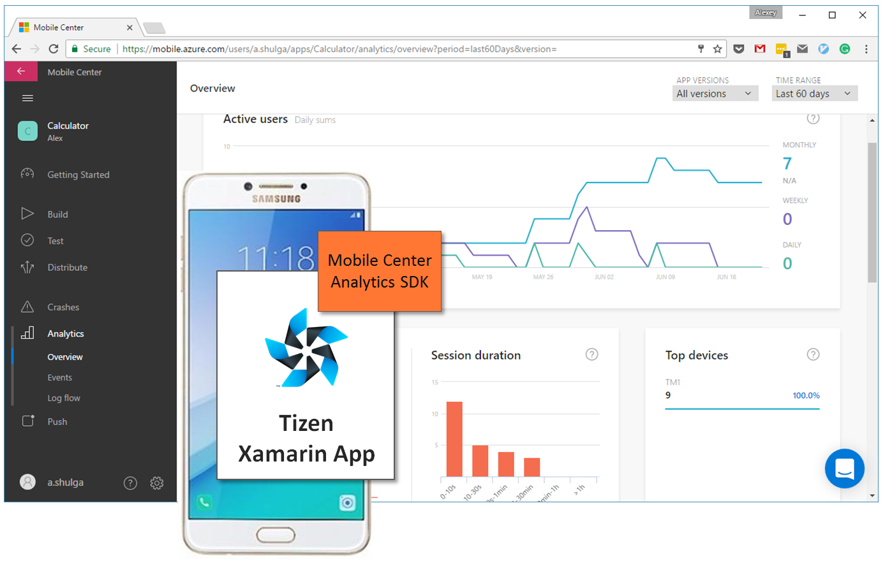
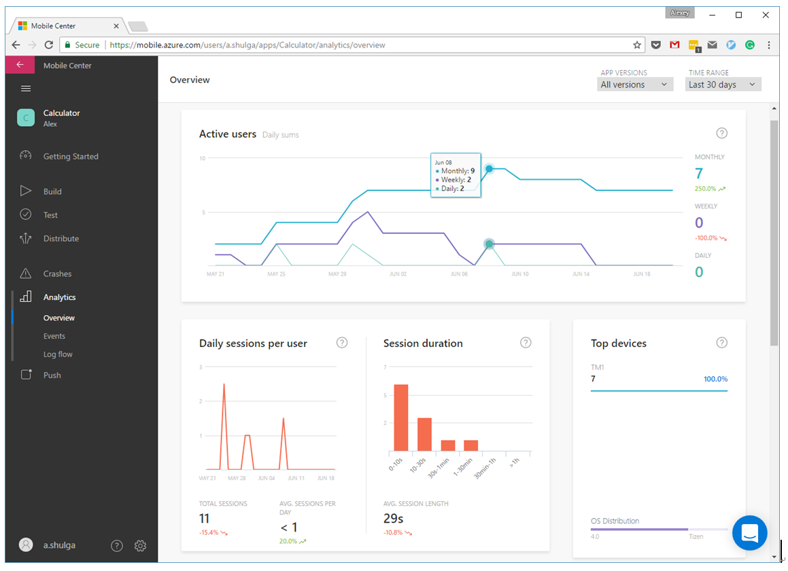
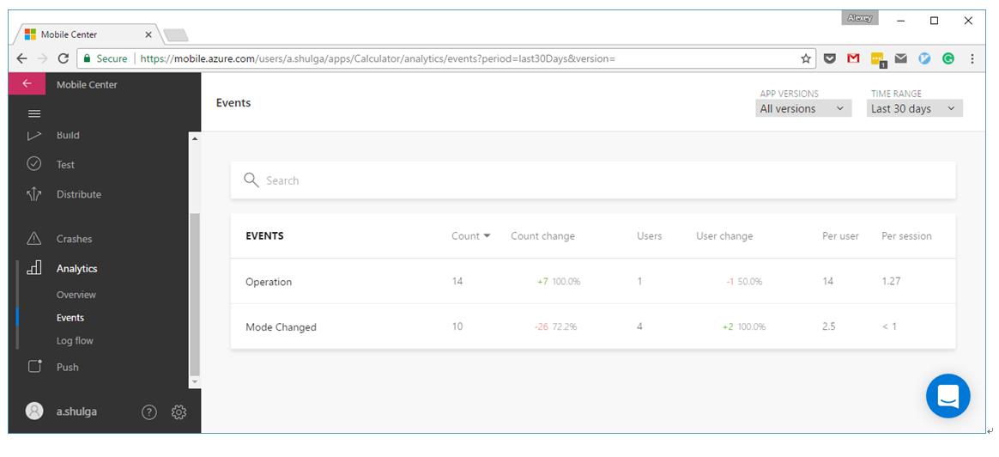
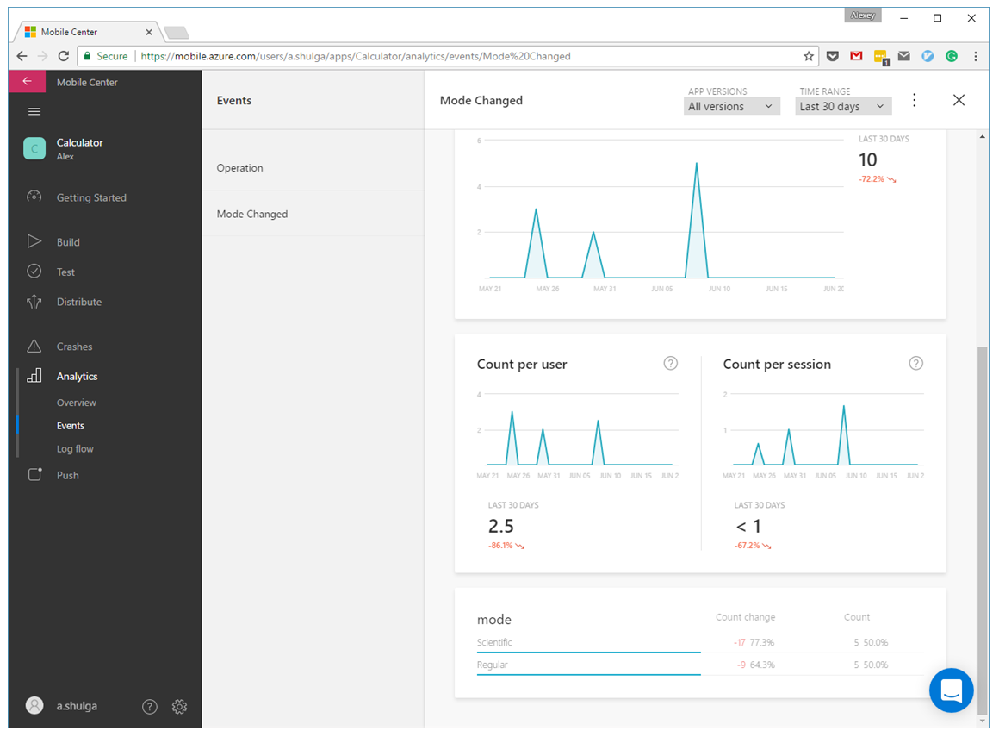
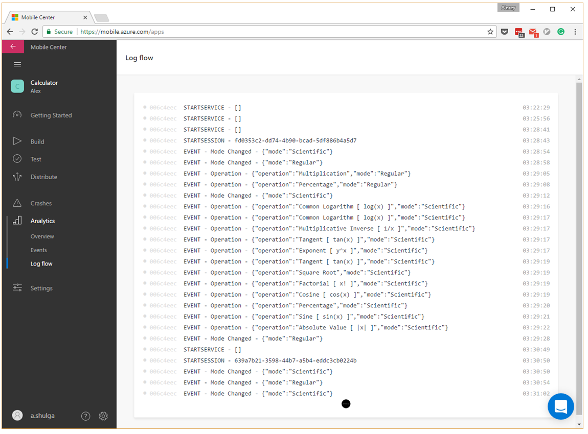

Tracking Tizen Mobile App Analytics
===================================


*by [@shulgaalexey](https://github.com/shulgaalexey)*


-------------------------------------

**Update** Now Mobile Center SDK is available on both Tizne Mobile and TV, Devices and Emulators.

-------------------------------------


Do you want to know how many users launch you App daily, weekly, monthly?

How long do the stay with you app on?

Where are they coming from and which smartphones are they on?

What features do they use the most?

In other words, did you consider adding Continuous Monitoring and Analytics into you Tizen Mobile App?
Let’s see how we can do it.


In this article we will show how to track Analytics of your Tizen Mobile App by using [Microsoft Visual Studio Mobile Center Analytics](https://docs.microsoft.com/en-us/mobile-center/analytics/), specifically tailored for Tizen App Developers by Tizen Platform Lab in partnership with Microsoft.


*Note. By the end of 2017 Analytics service is available in Preview mode for Tizen, Android, iOS, React Native, UWP and Xamarin.*


What is Mobile App Analytics?
-----------------------------

Mobile App Analytics is a multi-modal statistical and technical data, registered in the mobile app in the running time. It lets developers understand their end-user population, such as number of daily, weekly and monthly users, session duration, top devices, as well as usage patterns: the custom event tracking feature allows collecting rich behavioral insights.



All that data may be collected and visualized by different mobile app measurement tools and one of them, carefully tuned for Tizen, is Microsoft Visual Studio Mobile Center Analytics. The Mobile Center .NET SDK, integrated into your app, provides a set of C# APIs to send the Analytics directly to the Mobile Center Portal where it is visualized in figures and diagrams on the online dashboard. Following chapters demonstrate the usage of both API and Web Portal in a practical example.


Prerequisites
-------------

We assume that you already have basic knowledge in Tizen Xamarin App development. For basic information, see [https://developer.tizen.org/development/preview/getting-started](https://developer.tizen.org/development/preview/getting-started).

Make sure that your project is set up in Visual Studio and you are targeting Tizen Mobile devices. The instructions how to install Visual Studio Tools for Tizen are found there:
[https://developer.tizen.org/development/tizen-.net-preview/getting-started/installing-visual-studio-tools-tizen](https://developer.tizen.org/development/tizen-.net-preview/getting-started/installing-visual-studio-tools-tizen).


The Mobile Center API requires privileges to use the Internet and onboard SQLite DB for offline data preservation, so you should add following privileges to your Tizen Mobile App manifest:

```
<privileges>
    <privilege>http://tizen.org/privilege/internet</privilege>
    <privilege>http://tizen.org/privilege/network.get</privilege>
</privileges>
```


For integrating the Mobile Center Analytics into your app it is enough to add few .NET references which include Mobile Center SDK and its dependencies, required for Internet and storage operations. Navigate to the **Project -> Manage NuGet Packages...** and add to your Tizen Mobile App the following nupkgs with specified versions.

* Tizen.Applications, version 1.5.8
* Microsoft.Rest.ClientRuntime, version 2.3.6
* Newtonsoft.Json, version 10.0.2
* sqlite-net-pcl, version 1.3.1
* SQLitePCLRaw.core, version 1.1.2
* SQLitePCLRaw.provider.sqlite3.netstandard11, version 1.1.2

Note. Temporary the Tizen-compatible SDK is not available on the Nuget Gallery, so you can build it from the source codes.


1. Clone the SDK to your computer from the GitHub [https://github.com/Microsoft/mobile-center-sdk-dotnet/tree/Tizen/Preview](https://github.com/Microsoft/mobile-center-sdk-dotnet/tree/Tizen/Preview) and switch to Tizen/Preview branch:

```
git clone https://github.com/Microsoft/mobile-center-sdk-dotnet.git
cd mobile-center-sdk-dotnet
git checkout Tizen/Preview
```

2. Open the MobileCenter-SDK-Build-Tizen.sln solution in Visual Studio and build it.

3. Add SDK libraries to your Tizen Mobile App. Navigate to the **Project -> Add Reference… -> Browse**, press **Browse** button and select following two dlls:

```
./SDK/MobileCenter/Microsoft.Azure.Mobile.Tizen/bin/Release/Microsoft.Azure.Mobile.dll
./SDK/MobileCenterAnalytics/Microsoft.Azure.Mobile.Analytics.Tizen/bin/Release/Microsoft.Azure.Mobile.Analytics.dll
```


## 1. Create new Analytics App in the Mobile Center Portal

The initial step of adding Analytics to your Tizen app requires you to create a new app on the Mobile Center Portal where you can get the App Secret. You will use it soon in initializing the entire Mobile Center API in your Tizen App.

1. Head over to mobile.azure.com
2. Sign up or log in and hit the blue button on the top right corner of the portal that says **Add new** and select **Add new app** from the dropdown menu
3. Enter a name and an optional description for your app
4. Select the **Tizen OS** and **Xamarin platform**
5. Hit the button at the bottom right that says **Add new app**

Once you have created an Analytics App, you can obtain its **App Secret** on the **Getting Started** or **Manage App** sections of the Mobile Center Portal.


## 2. Integrate Analytics into your App

Getting Analytics only requires you to initialize it with one line of code. Doing this will immediately get the data flowing to Analytics Service of Mobile Center Portal. The Overview page will represent your data, albeit minimal, within seconds of your app run and the Events page will show deep insight into your user base and user behavioral patterns. The programming tasks are following:

1. Open your app main source file, such as ```HelloWorld.Tizen.cs```, and add ```start()``` call inside the ```OnCreate()``` method:

```
MobileCenter.Start("{Your App Secret}", typeof(Analytics));
```

Make sure to replace ```{Your App Secret}``` with the actual value for your application. (The App Secret can be found on the **Getting Started** page on the Mobile Center portal or through the **Manage App** button, as described in the previous chapter)

The ```start()``` API can be used only once in the lifecycle of your pap – all other calls will log a warning to the console and only the modules included in the first call will be available.

2. Add the appropriate namespaces before calling the API:

```
using Microsoft.Azure.Mobile;
using Microsoft.Azure.Mobile.Analytics;
```

3. In order to track custom events you should use ```TrackEvent()``` method in any part of your app once you have started the API. Events measure the user's interaction with the content in the app and allow you to better understand your user's behavior. Deeper contextual information may be assigned with event properties.

*Note, that there is a maximum of 256 characters supported per event name and 64 characters per event property name and event property value name.*

```
// Track the event of
// Calculator App mode change from Simple to Scientific
// on device orientation changed from Portrait to Landscape
Analytics.TrackEvent("Mode Changed",
   new Dictionary<string, string> { { "mode", "Scientific" } });
```

The clever feature of the Mobile Center SDK is storing Analytics in the onboard SQLite DB while offline. As soon as the Internet becomes available and the app is running, the data is being transferred automatically to the Mobile Center Portal.

4. Trace different levels of logs to console with ```MobileCenterLog``` API:

```
// Configure log visibility level: emit all logs
MobileCenter.LogLevel = LogLevel.Verbose;

// Log the exception
MobileCenterLog.Debug(MobileCenterLog.LogTag, $"{exc}")
```

Other useful values of verbosity are: ```None, Error, Warn``` and ```Debug``` and the corresponding logging APIs are: ```Error(), Warn()``` and ```Debug()```.
The logs may be observed on the Tizen Sdb console by using the command:

```
sdb shell dlogutil MC_TEST
```

*Note. For even more information about API, refer to the detailed Mobile Center SDK documentation at* [https://docs.microsoft.com/en-us/mobile-center/sdk/](https://docs.microsoft.com/en-us/mobile-center/sdk/)

Now the Analytics tracking is completely integrated into your Tizen Mobile App and we are ready to build and deploy it on a target device or emulator.


## 3. Observe the Analytics on Mobile Center Portal

Once you launched your Tizen Mobile App, the Analytics starts flowing to the Mobile Center immediately. By clicking on **Analytics** in the right side of the Mobile Center Portal you will open the **Overview** page, which provides general predefined key metrics about your app users’ population: their devices, their locations, activity and engagement. This will enable answers to questions such as:

* Should I translate my app into a new language?
* Are my users majoritarily on the lastest version?
* What are the main devices used?
* Can I remove support for that old OS version? and many more.



*Note. For more details about Overview page refer to* [https://docs.microsoft.com/en-us/mobile-center/analytics/overview](https://docs.microsoft.com/en-us/mobile-center/analytics/overview).


Switching to **Events** page will present a table with an overview of the events happening in your app. For each event you will see the number of users who have triggered an event during the selected period of time, change of that number in a course of app usage, total number of events triggered, dynamics of this number changing and many other indicators.




While diving deeper and clicking on an event in the events table, you will access to a more detailed page, in which further information about event properties is provided.



*Note. For better understanding of Events page visit* [https://docs.microsoft.com/en-us/mobile-center/analytics/event-metrics](https://docs.microsoft.com/en-us/mobile-center/analytics/event-metrics).


The final page in the **Analytics** section is **Log Flow**. Here you can see your incoming activity in a raw format.




What we learned today?
----------------------

You can collect and visualize valuable Analytics about your users’ population and behavioral patterns by adding a couple of lines of code to your Tizen Xamarin Mobile App and integrating it with Mobile Center Portal.

Mobile Center Analytics SDK is tailored for Tizen and available on the GitHub.

The Portal and SDK are in the Preview mode and free of charge. Give it a try and develop your Analytics strategy which serves the best your Tizen Mobile App, ignites innovations and brings benefits and new opportunities to you and your users.


What's next?
------------

Read about [Continuous Integration](https://github.com/shulgaalexey/gallery-dotnet-sdk-tizen/blob/master/ContinuousIntegration.md) for your Tizen Xamarin App

Check out the [Gallery of 3rd Party C# API](https://shulgaalexey.github.io/gallery-dotnet-sdk-tizen/) available for Tizen


Reference
---------

* Tizen Developer page: https://developer.tizen.org/
* Mobile Center Portal: https://mobile.azure.com/apps
* Mobile Center documentation: https://docs.microsoft.com/en-us/mobile-center/
* Mobile Center SDK documentation: https://docs.microsoft.com/en-us/mobile-center/sdk/
* Mobile Center SDK sources: https://github.com/Microsoft/mobile-center-sdk-dotnet/tree/Tizen/Preview
* Sample application with Analytics tracking: https://github.com/shulgaalexey/calculator_tizen_xamarin
* Slides of Mobile Center intro on Tizen Developer Conference 2017: https://www.slideshare.net/AlexeyShulga/03-02-tizen-app-development-with-visual-studio-mobile-center-and-team-services


---------------------


[home](https://shulgaalexey.github.io/gallery-dotnet-sdk-tizen/)

[comment](https://github.com/shulgaalexey/gallery-dotnet-sdk-tizen/issues/new)