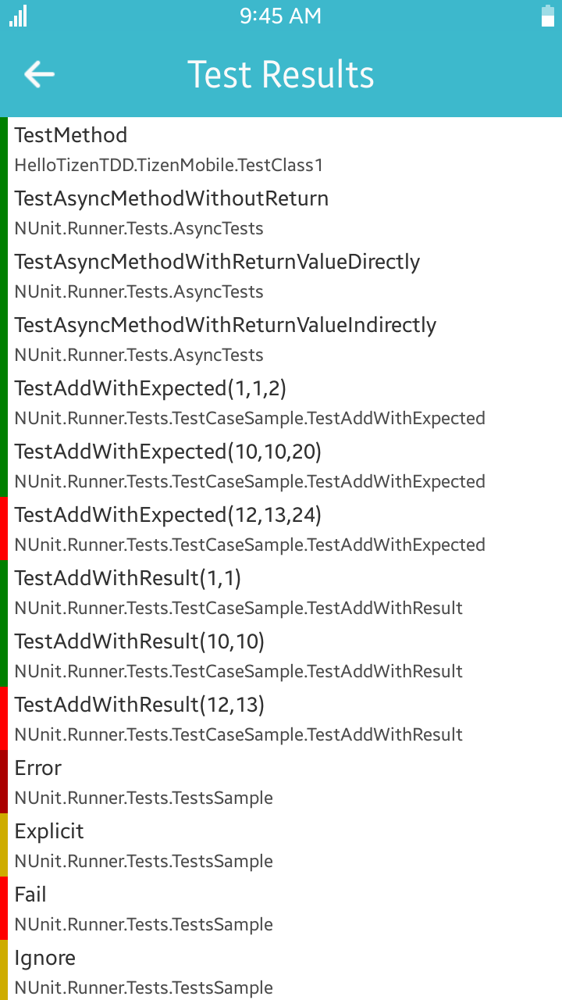

TDD for Tizen App with NUnit Xamarin SDK
========================================


*by [@shulgaalexey](https://github.com/shulgaalexey)*


Are you developing Tizen Xamarin App and looking for a TDD framework?

Are you using NUnit TDD solutions on other mobile platforms and planning to integrate it on Tizen too?

Are you studying TDD for the very first time?

Read this step-by-step guide where you will find a detailed instructions on how to use nunit.xamarin test framework which offers a cross-platform SDK with GUI and XML report generation features.

For the comprehensive NUnit feature coverage, please, visit the [project site](http://nunit.org/).


*Note. By the end of 2017 Tizen .NET and Tizen Xamarin Mobile and TV Apps are available in the Preview mode.*


## What is TDD?

[Test-driven development (TDD)](https://en.wikipedia.org/wiki/Test-driven_development) is a software development process that relies on the repetition of a very short development cycle: requirements are turned into very specific test cases, then the software is improved to pass the new tests, only.

This "test-first" programming technique, created by [Kent Beck](https://en.wikipedia.org/wiki/Kent_Beck), is opposed to software development that allows to add software that is not proven to meet requirements.


The sequence of steps in TDD is generally as following:

 1. Add a test
 2. Run all tests and see if the new one fails
 3. Write some code
 4. Run tests
 5. Refactor code
 6. Repeat


**A graphical representation of the test-driven development lifecycle.** [Picture source: Wikipedia](https://upload.wikimedia.org/wikipedia/commons/0/0b/TDD_Global_Lifecycle.png)


The TDD improves the quality and readability of your code, make it self documented and increase the overall productivity of the entire development process.

The proven approach declares that you should prepare a collection of test cases, covering all or almost all of your app functionality. 

Each test case life cycle should include phases of setup, execution, validation and cleanup.
Best practices recommend to separate set-up and tear-down routines, common for a group of test cases.

You should always start unit test from a known and pre-configured state.

The ultimate target of the unit test is to ensure that the results and behaviour of the tested entity are correct.

On the other hand it is important to avoid complicated test cases ([KISS principle](https://en.wikipedia.org/wiki/KISS_principle)), test cases with interdependencies (execution of one test shouldn't be interfered by another), "all-knowing oracles", slow running tests, and other "anti-patterns".


## How to get started?

First of all, we assume that you already have basic knowledge in Tizen Xamarin App development. For basic information, see [https://developer.tizen.org/development/preview/getting-started](https://developer.tizen.org/development/preview/getting-started).

For the instructions how to install Visual Studio Tools for Tizen, see [https://developer.tizen.org/development/tizen-.net-preview/getting-started/installing-visual-studio-tools-tizen](https://developer.tizen.org/development/tizen-.net-preview/getting-started/installing-visual-studio-tools-tizen).


## 1. Integrating nunit.xamarin in your project


### You own nunit.xamarin Tizen GUI

To integrate nunit.xamarin test suite in your project you should add a new Tizen Xamarin App.

Right click on your solution and navigate to **Add -> New Project... -> Tizen -> Blanc App (Tizen Xamarin.Forms Single)**.

Double click in the **Solution Explorer** the program file of newly created app and edit the ```OnCreate()``` function as following.

```cs
	protected override void OnCreate()
        {
            base.OnCreate();

            // Tizen will not load all tests within the current project,
            // you must do it explicitly below
            var nunit = new NUnit.Runner.App();

            // If you want to add tests in another assembly, add a reference and
            // duplicate the following line with a type from the referenced assembly
            //nunit.AddTestAssembly(typeof(MainPage).GetTypeInfo().Assembly);
            nunit.AddTestAssembly(typeof(Program).GetTypeInfo().Assembly);

            // Available options for testing
            nunit.Options = new TestOptions
            {
                // If True, the tests will run automatically when the app starts
                // otherwise you must run them manually.
                AutoRun = true,

                // If True, the application will terminate automatically after running the tests.
                //TerminateAfterExecution = true,

                // Information about the tcp listener host and port.
                // For now, send result as XML to the listening server.
                // NOTE: Your UWP App must have Private Networks capability enabled
                //TcpWriterParameters = new TcpWriterInfo("192.168.0.108", 13000),

                // Creates a NUnit Xml result file on the host file system using PCLStorage library.
                CreateXmlResultFile = false,

                // Choose a different path for the xml result file
                // ResultFilePath = System.IO.Path.Combine(Windows.Storage.ApplicationData.Current.TemporaryFolder.Path, "Nunit", "Results.xml")
            };

            LoadApplication(nunit);
        }
```

*Note that now you can remove the default App class, generated by Tizen Xamarin App template, because it is substituted by the NUnit App class.*

For your developer convenience you can use system logs, for example:

```cs
NUnitLogs.LogMessage($"*********OnCreate***********");
```

The logs may be observed on the Tizen Sdb console by using the command:

```
sdb shell dlogutil NUNIT
```


### Code ninja way

Get the full controll of your dependencies. Building nunit.xamarin SDK out of source codes and integrate it in your project with following three simple steps:

1. Clone the SDK to your computer from the GitHub [https://github.com/shulgaalexey/nunit.xamarin](https://github.com/shulgaalexey/nunit.xamarin) and switch to Tizen/Preview branch:

```
git clone https://github.com/shulgaalexey/nunit.xamarin
cd nunit.xamarin
git checkout Tizen/Preview
```

2. Open the nunit.runner.sln.sln solution in Visual Studio and build nunit.runner.Tizen project in the Runner folder.

3. Add SDK library to your Tizen Xamarin App. Navigate to the **Project -> Add Reference… -> Browse**, press **Browse** button and select following two dlls:

```
./src/runner/nunit.runner.Tizen/bin/Release/nunit.runner.Tizen.dll
```


### You are the Boss of Continuous Integration

If you are establishing your Tizen App Development Process on the base of [Continuous Integration](ContinuousIntegration.md), you will find useful integrating nunit.xamarin SDK via nupkg from the MyGet.
Configure nupkg repository source ```https:\\todo``` and add the package ```nuget.xamarin.tizen``` version 3.7.0 or later.


## 2. Preparing test cases


To add new test cases follow the recommendations on the NUnit [project site](http://nunit.org/).

In the IDE navigate to the **Project -> Add New Item... -> Test -> NUnit**, specify test class name and press **Add** button.

Congratulations, your tests are ready for the first start!

Read more about validation API and test case annotations on the NUnit [project site](http://nunit.org/).


## 3. Checking test report: GUI and XML

Running tests require either Tizen Emulator of Target Device. Both TV and Mobile should work fine.

Set your TDD project as an executable in the solution by right clicking on it and selecting **Set as Startup Project**, attach the device to the USB or launch the Emulator (**Tools -> Tizen -> Tizen Emulator Manager**) and press **F5**.

In a moment you should see the app with a test report, including test case overall results, all test results and failed only test.


**Overall results**




**All tests**


**Failed tests**


TODO: write about XML report


## What we learned today?

You can and, for sure, should develop your Tizen Mobile or TV App in a TDD manner.

We propose to use nunit.xamarin SDK which offers testing capcities of popular NUnit Framework represented on a GUI and in XML reports.

Tizen .NET and Tizen Xamarin Mobile and TV Apps are currently in the Preview mode and you can try it completely free of charge.

Give it a try and develop your own well tested world class Tizen apps.


## What's next?

The TDD allows you to develop and maintain perfect apps.

However on the next phase of your app life cycle, when it is shipped to you users, yom may instrument it further with continuous monitoring tools.

Read how you can integrate [Mobile Analytics](https://github.com/shulgaalexey/gallery-dotnet-sdk-tizen/blob/master/MobileCenterAnalytics.md) into your Tizen Xamarin App


To make your Tizen app development and delivery smooth, you may design your process based on Continuous Integration technique.

Study how can you set up CI for Tizen [here](ContinuousIntegration.md).


And finally, check out the [Gallery of 3rd Party C# API](https://shulgaalexey.github.io/gallery-dotnet-sdk-tizen/) available for Tizen


## Reference


* Tizen Developer page: [https://developer.tizen.org/](https://developer.tizen.org/)
* Sample application demonstrating nunit.xamarin and TDD: [https://github.com/shulgaalexey/HelloTizenTDD](https://github.com/shulgaalexey/HelloTizenTDD)
* The nunit.xamarin for Tizen on the GitHub: [https://github.com/shulgaalexey/nunit.xamarin/tree/Tizen/Preview](https://github.com/shulgaalexey/nunit.xamarin/tree/Tizen/Preview)
* The ninut.xamarin.tizen nupkg on the MyGet: TODO add link
* NUnit home page: [http://nunit.org/](http://nunit.org/)
* [TDD on Wikipedia](https://en.wikipedia.org/wiki/Test-driven_development)

